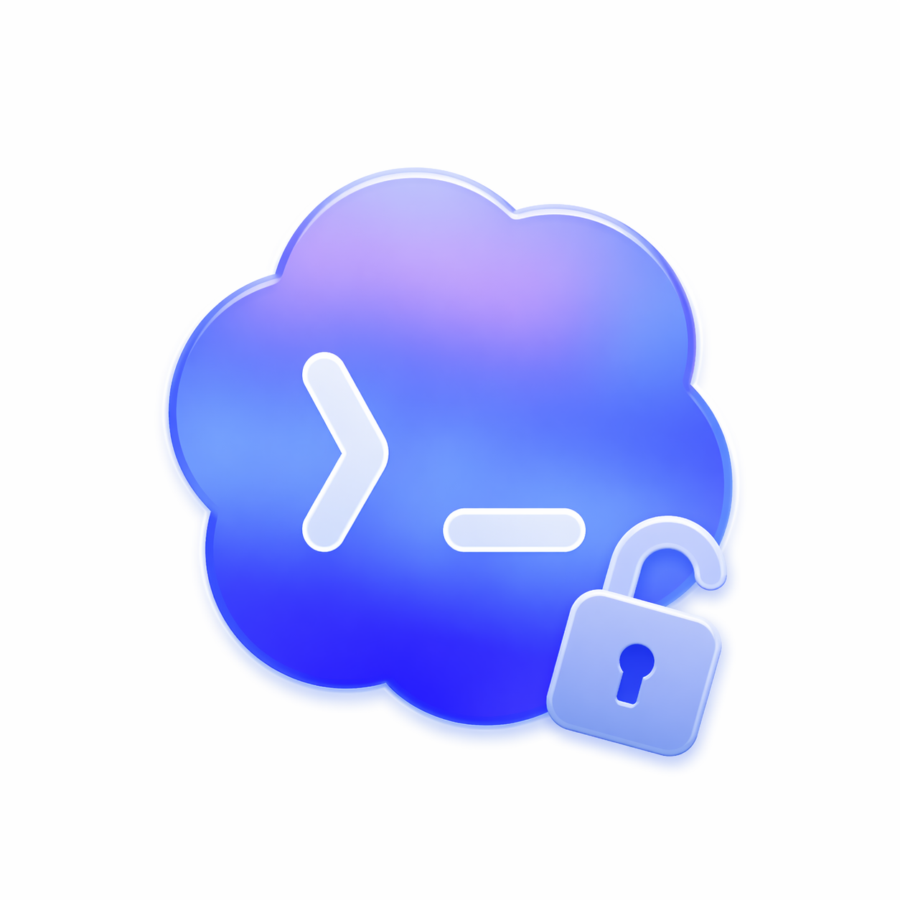

<p align="center">
  
</p>

<h1 align="center">Open Codex CLI</h1>

<p align="center">
  A community-maintained Codex CLI fork that stays close to upstream while making room for openly developed CLI improvements.
</p>

<p align="center">
  <code>codex</code> remains the command name, and <code>@openai/codex</code> remains the compatibility target for the current CLI surface.
</p>

<p align="center">
  <a href="#english"></a>
  <a href="#简体中文"></a>
</p>

<p align="center">
  GitHub README does not allow JavaScript-based language toggles, so this page uses collapsible language sections as the practical equivalent.
</p>

---

<details open>
<summary><strong id="english">English</strong></summary>

## Motivation

Codex CLI is open source, but upstream code contributions are currently invitation-only. The upstream repository states this clearly in [docs/contributing.md](./docs/contributing.md): external pull requests that have not been explicitly invited will be closed without review.

That policy is understandable from the perspective of the upstream maintainers, but it also leaves a gap for developers who want to iterate in public, ship focused CLI improvements, and maintain a fork that can accept normal community collaboration. This repository exists to fill that gap.

The goal of **Open Codex CLI** is not to diverge for the sake of divergence. The goal is to keep a small, intentional delta on top of upstream Codex CLI, make that delta easy to understand, and keep the fork mergeable as upstream evolves.

## Current Delta vs. Latest Upstream Codex CLI

This fork is currently based on the latest upstream `openai/codex` and adds a small set of focused CLI improvements from recent fork-specific commits:

### 1. Better transcript contrast in the TUI for Zellij

From commit `598bebc6b`:

- improves visual distinction between user-authored content and assistant-rendered content when Codex CLI is used inside `zellij`
- adjusts the TUI styling path used by user message rendering for the `zellij` case
- targets a real readability issue in `zellij`; this is not the same problem in a normal terminal session or in `tmux`

This is a usability-focused patch for the `zellij` environment: the goal is to reduce ambiguity in the chat history without changing the underlying interaction model.

For context: [Zellij](https://github.com/zellij-org/zellij) is a terminal workspace / terminal multiplexer. Compared with `tmux`, it puts more emphasis on a batteries-included user experience, richer pane behavior, built-in layouts, and more discoverable interaction patterns out of the box.

### 2. Stale turn output protection in the TUI

From commits `642d306a7` and `6c27de579`:

- adds turn-aware filtering for streamed assistant output
- prevents stale deltas from older turns from leaking into the currently active turn
- hardens replay and status handling around message deltas, reasoning deltas, and turn completion events
- adds regression coverage for the stale-turn cases that motivated the fix

This is a correctness-focused patch: the UI should not render output from the wrong turn, even when retry, replay, or stream timing gets messy.

## Maintenance Philosophy

This fork is maintained with a conservative strategy:

- keep the fork close to upstream `openai/codex`
- merge upstream regularly rather than carrying a long-lived reimplementation
- keep fork-specific patches small, testable, and easy to reason about
- prefer user-facing CLI quality improvements over broad architectural churn
- document motivation, tradeoffs, and intended maintenance cost in the repo itself

In practice, maintenance will follow a straightforward loop:

1. track the latest upstream Codex CLI changes
2. merge upstream into this fork on a regular basis
3. re-validate the fork-specific delta
4. keep or refine only the patches that still provide clear value

The standard for changes here is simple: if a patch is not worth carrying across upstream merges, it does not belong in the fork.

## Roadmap

The near-term roadmap is intentionally focused on a few CLI-facing improvements:

### 1. Status line throughput visibility

Improve the Codex CLI status line so it can surface token throughput directly, instead of only showing coarse task state. The aim is to make model responsiveness easier to judge in real time.

### 2. Session export

Implement a Claude Code-style export flow for the current session, so a user can export the active session record in a reusable format. The goal is to make debugging, sharing, and archival much easier.

### 3. Better memory mechanics

Improve the Codex memory mechanism so it is easier to understand, easier to inspect, and more useful over long-running usage. The focus here is not just more memory, but better memory behavior.

### 4. Better Zellij ergonomics

Continue improving the Codex CLI experience under `zellij`, especially around rendering, layout, contrast, and other interaction details that behave differently from plain terminal sessions or `tmux`.

## Community

Issues and pull requests are welcome in this fork.

If you have a bug report, a CLI usability problem, a design idea, or a concrete patch, please open an issue or submit a PR. Small, focused, well-explained changes are preferred over broad, unrelated edits.

The intent of this repository is to keep development open and reviewable in public, even while the upstream repository remains invitation-only for external code contributions.

## Compatibility Notes

This fork keeps the current Codex CLI naming surface intact:

- command name: `codex`
- package naming target: `@openai/codex`

That means the README, docs, and fork messaging are intentionally about the project identity and maintenance model, not a wholesale rename of the CLI interface.

## Quickstart

If you want to use this fork from source, build the Rust workspace and install the resulting binary locally.

```shell
# Clone the fork and build the CLI
git clone https://github.com/LEON-gittech/codex.git
cd codex/codex-rs
cargo build --release
```

Then choose one of these install modes:

### Option A: replace your local `codex`

```shell
mkdir -p ~/.local/bin
install -m 755 target/release/codex ~/.local/bin/codex
```

### Option B: install this fork as `codex-dev`

```shell
mkdir -p ~/.local/bin
install -m 755 target/release/codex ~/.local/bin/codex-dev
```

After that, run either `codex` or `codex-dev`, depending on which install path you chose.

## Docs

- [Contributing](./docs/contributing.md)
- [Installing & building](./docs/install.md)
- [Open source fund](./docs/open-source-fund.md)

## License

This repository is licensed under the [Apache-2.0 License](./LICENSE).

</details>

<details>
<summary><strong id="简体中文">简体中文</strong></summary>

## 背景动机

Codex CLI 是开源的，但上游仓库当前对外部代码贡献采用 invitation-only 策略。上游仓库在 [docs/contributing.md](./docs/contributing.md) 中写得很明确：没有被明确邀请的外部 PR 会被直接关闭，不进入正常 review 流程。

从上游维护者的角度，这个策略是可以理解的；但对于想要公开迭代、持续提交 CLI 改进、并让社区可以正常协作的人来说，这中间就出现了一个空白。这也是这个 fork 存在的原因。

**Open Codex CLI** 的目标不是为了分叉而分叉，而是在尽量贴近 upstream Codex CLI 的前提下，保留一层小而明确、容易理解、也容易持续维护的公开改动。

## 当前相对最新 Upstream Codex CLI 的差异

这个 fork 目前基于最新的 `openai/codex`，并在最近几条 fork 自有 commit 的基础上增加了几项聚焦的 CLI 改进：

### 1. 面向 Zellij 的 TUI transcript 对比度优化

来自 commit `598bebc6b`：

- 改善了在 `zellij` 环境下用户消息与 assistant 输出之间的视觉区分度
- 调整了 `zellij` 场景下用户消息渲染路径的样式策略
- 解决的是 `zellij` 下真实存在的可读性问题，而不是普通 terminal 或 `tmux` 下的通用问题

这是一个面向 `zellij` 使用环境的可用性优化，目标是在不改变交互模型的前提下，降低 transcript 阅读时的歧义。

补充说明：[Zellij](https://github.com/zellij-org/zellij) 是一个 terminal workspace / terminal multiplexer。相比 `tmux`，它更强调开箱即用的体验、更丰富的 pane 行为、内建布局能力，以及更容易发现的交互方式。

### 2. TUI 中的 stale turn output 保护

来自 commits `642d306a7` 和 `6c27de579`：

- 为流式 assistant 输出增加了 turn-aware 过滤
- 防止旧 turn 的 delta 混入当前 active turn
- 强化了 replay、reasoning delta、turn completion 等路径下的状态处理
- 增加了针对 stale-turn 场景的回归测试覆盖

这是一个偏正确性的修复：即使在 retry、replay、stream 时序比较复杂的情况下，UI 也不应该把错误 turn 的输出渲染出来。

## 维护思路

这个 fork 的维护策略是偏保守的：

- 尽量保持与 upstream `openai/codex` 接近
- 通过持续 merge upstream，而不是长期走大幅重写路线
- 保持 fork 自有 patch 小而清晰、可测试、可解释
- 优先关注面向 CLI 用户的真实体验改进，而不是无边界扩张
- 在仓库内直接记录动机、取舍和维护成本

实际维护会遵循一个比较直接的循环：

1. 跟踪 upstream Codex CLI 的最新变化
2. 定期把 upstream merge 进这个 fork
3. 重新验证 fork 的自有差异是否仍然成立
4. 只保留那些在持续 merge 成本下仍然值得维护的 patch

标准很简单：如果一个 patch 不值得长期跟随 upstream 一起维护，它就不应该存在于这个 fork 中。

## 路线图

接下来会优先推进几项面向 CLI 的改进：

### 1. Status line 中增加 token throughput 可见性

改进 Codex CLI 的 status line，让它可以直接展示 token 吞吐，而不只是显示比较粗粒度的任务状态，便于更直观判断模型响应效率。

### 2. Session export

实现类似 Claude Code 的 session 导出能力，让用户可以把当前会话记录导出成可复用格式，方便调试、归档和分享。

### 3. 更好的 memory 机制

改进 Codex 的 memory 机制，让它更容易理解、更容易检查，也更适合长时间使用场景。重点不是“更多 memory”，而是“更好的 memory 行为”。

### 4. 更好的 Zellij 使用体验

继续针对 `zellij` 下的 Codex CLI 使用体验做优化，包括渲染、布局、对比度，以及其他与普通 terminal 或 `tmux` 表现不同的交互细节。

## 社区协作

这个 fork 欢迎 issue 和 pull request。

如果你有 bug report、CLI 可用性问题、设计想法，或者已经有一个清晰的小 patch，都欢迎直接提 issue 或 PR。相比大而杂的改动，这里更偏好小范围、聚焦、说明充分的提交。

这个仓库的目标之一，就是在 upstream 仍然对外部代码贡献采用 invitation-only 策略的情况下，继续保持公开、可 review、可协作的开发方式。

## 兼容性说明

这个 fork 保留当前 Codex CLI 的命名表面：

- 命令名仍然是：`codex`
- 当前兼容的包命名目标仍然是：`@openai/codex`

也就是说，这份 README 的重点是项目身份和维护方式，而不是把 CLI 的命令名整体重命名掉。

## Quickstart

如果你想从源码使用这个 fork，可以先构建 Rust workspace，再把产出的二进制安装到本地。

```shell
# 克隆仓库并构建 CLI
git clone https://github.com/LEON-gittech/codex.git
cd codex/codex-rs
cargo build --release
```

然后在下面两种安装方式中选一个：

### 方式 A：直接覆盖你本地的 `codex`

```shell
mkdir -p ~/.local/bin
install -m 755 target/release/codex ~/.local/bin/codex
```

### 方式 B：并行安装为 `codex-dev`

```shell
mkdir -p ~/.local/bin
install -m 755 target/release/codex ~/.local/bin/codex-dev
```

之后根据你的安装方式，运行 `codex` 或 `codex-dev` 即可。

## 文档

- [Contributing](./docs/contributing.md)
- [Installing & building](./docs/install.md)
- [Open source fund](./docs/open-source-fund.md)

## 许可证

本仓库使用 [Apache-2.0 License](./LICENSE)。

</details>
